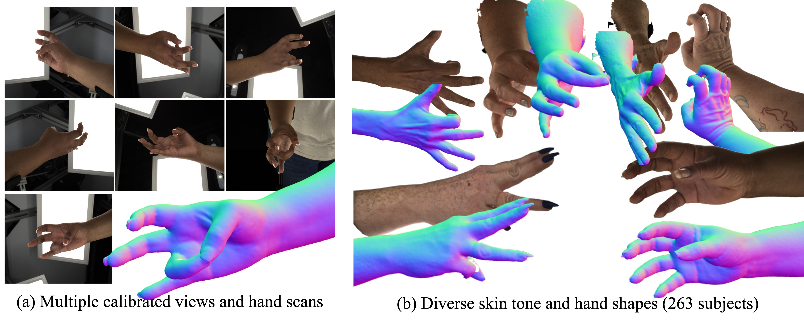

## PALM: A Dataset and Baseline for Learning Multi-subject Hand Prior ([Paper](https://arxiv.org/abs/2511.05403))

[Zicong Fan](https://zc-alexfan.github.io/), [Edoardo Remelli](https://scholar.google.com/citations?user=yz2P_aUAAAAJ&hl=en), David Dimond, [Fadime Sener](https://scholar.google.com/citations?user=-juoweoAAAAJ&hl=en), [Liuhao Ge](https://scholar.google.com/citations?user=PTsnx5gAAAAJ&hl=en), [Bugra Tekin](https://btekin.github.io/), [Cem Keskin](https://scholar.google.com/citations?user=9HoiYnYAAAAJ&hl=en), [Shreyas Hampali](https://shreyashampali.github.io/)

### News

🚀 Register a PALM account [here](https://forms.gle/zbNPFtJDaZP4cQmz7) for news such as code release, downloads, and future updates!

- 2025.11.07: PALM is accepted to 3DV'26!

<p align="center">
    
</p>

This is a repository for PALM, a large-scale dataset comprising calibrated multi-view high-resolution RGB images and 3dMD hand scans (a). It features 263 subjects spanning a wide range of skin tones and hand sizes, 90k RGB images, and 13k high-quality hand scans with corresponding MANO registrations (b). This diversity and precision provide a foundation for learning a universal prior over human hand shape and appearance.

### Why use PALM?

Summary on dataset:

- 90k multi-view RGB images
- Accurate MANO registration
- 263 subjects
- 7 RGB views
- 2448 x 2048 high resolution images
- 13k 3dMD hand scans


Potential directions from PALM:

- Synthetic data for hand pose estimation
- Hand personalization
- Learning high-resolution hand foundation models
- Generative model of hand with diverse skin tone and texture
- Naive use case: Unwrap UV texture from RGB images for downstream tasks


### Features

- Instructions to download the PALM dataset
- Scripts to load and visualize PALM dataset
- Code to leverage our multi-subject hand prior


### Getting started

Get a copy of the code and set permissions: 

```bash
git clone https://github.com/facebookresearch/PALM.git
cd PALM; git submodule update --init --recursive
cd code; chmod +x *.sh
```

- Setup environment: see [`docs/setup.md`](docs/setup.md)
- Data documentation (downloads, checkpoints, dataset, log folder): see [`docs/data_doc.md`](docs/data_doc.md)

If you only want to use the data: Follow our instructions here [`docs/palm.md`](docs/palm.md)

If you want to use the model:

- Put PALM under `./code/load/PALM/XR20B/folders/SUBJECT_ID/` for dataset path (see `configs/dataset/prior.yaml`)
- Training prior on PALM or to optimize PALM for personalization and relighting: see [`docs/palmnet.md`](docs/palmnet.md)
- Preprocess custom images for PALM-Net personalization: see [`generator/README.md`](generator/README.md)
- Evaluation on InterHand2.6M: see [`docs/interhand.md`](docs/interhand.md)

## Official Citation

```bibtex
@inproceedings{fan2026palm,
  title={{PALM}: A Dataset and Baseline for Learning Multi-subject Hand Prior},
  author={Fan, Zicong and Remelli, Edoardo and Dimond, David and Sener, Fadime and Ge, Liuhao and Tekin, Bugra and Keskin, Cem and Hampali, Shreyas},
  booktitle={2026 International Conference on 3D Vision (3DV)},
  year={2026},
  organization={IEEE}
}
```

### Contact

For technical questions, please create an issue. For other questions, please contact the [first author](https://zc-alexfan.github.io/).

### Acknowledgments

The authors would like to thank: [Xu Chen](https://xuchen-ethz.github.io) for feedback on SNARF, [Quoc Nguyen](https://www.linkedin.com/in/quoc-nguyen-755aab166/) for compute support.

Our code benefits a lot from [IntrinsicAvatar](https://github.com/taconite/IntrinsicAvatar), [SNARF](https://github.com/xuchen-ethz/snarf), [FastSNARF](https://github.com/xuchen-ethz/fast-snarf). If you find our work useful, consider checking out and citing the following papers:

```bibtex
@inproceedings{WangCVPR2024,
  title   = {IntrinsicAvatar: Physically Based Inverse Rendering of Dynamic Humans from Monocular Videos via Explicit Ray Tracing},
  author  = {Shaofei Wang and Bo\v{z}idar Anti\'{c} and Andreas Geiger and Siyu Tang},
  booktitle = {IEEE Conf. on Computer Vision and Pattern Recognition (CVPR)},
  year    = {2024}
}

@article{Chen2023PAMI,
  author = {Xu Chen and Tianjian Jiang and Jie Song and Max Rietmann and Andreas Geiger and Michael J. Black and Otmar Hilliges},
  title = {Fast-SNARF: A Fast Deformer for Articulated Neural Fields},
  journal = {Pattern Analysis and Machine Intelligence (PAMI)},
  year = {2023}
}

@inproceedings{chen2021snarf,
  title={SNARF: Differentiable Forward Skinning for Animating Non-Rigid Neural Implicit Shapes},
  author={Chen, Xu and Zheng, Yufeng and Black, Michael J and Hilliges, Otmar and Geiger, Andreas},
  booktitle={International Conference on Computer Vision (ICCV)},
  year={2021}
}
```
